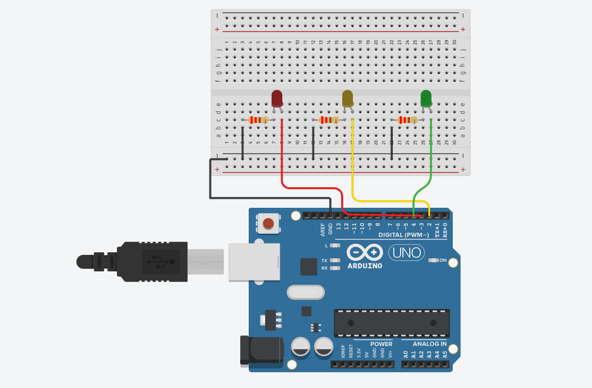

 # 🚦 Arduino Traffic Light

A simple traffic light simulation using Arduino Uno and three LEDs.

---

## 📖 Description

This project simulates the behavior of a real traffic light using three LEDs connected to an Arduino Uno.

The LEDs light up in the following order:

- 🔴 Red
- 🟡 Yellow
- 🟢 Green

The sequence repeats continuously.

---

## 🛠 Components

- Arduino Uno
- Breadboard
- 3 LEDs
- 3 × 220 Ω Resistors
- Jumper Wires

---

## 🔌 Wiring

| LED | Arduino Pin |
|------|-------------|
| 🔴 Red | D3 |
| 🟡 Yellow | D2 |
| 🟢 Green | D4 |

---

## 📷 Circuit

---

## 🎥 Simulation

Download or watch the simulation:

[simulation.mp4](simulation.mp4)

---

## 💻 Source Code

The Arduino source code is available in:

`traffic_light.ino`

---

## 👩‍💻 Author

**Sara Tahir**

Second-Year Engineering Student
